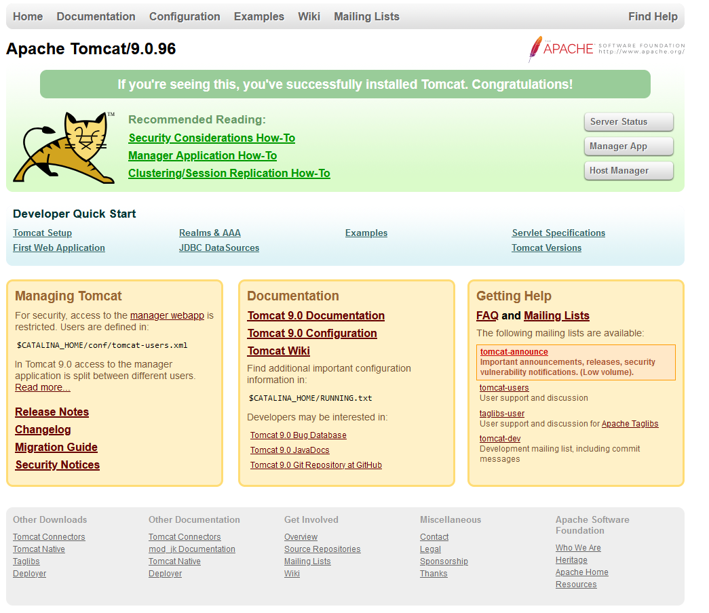
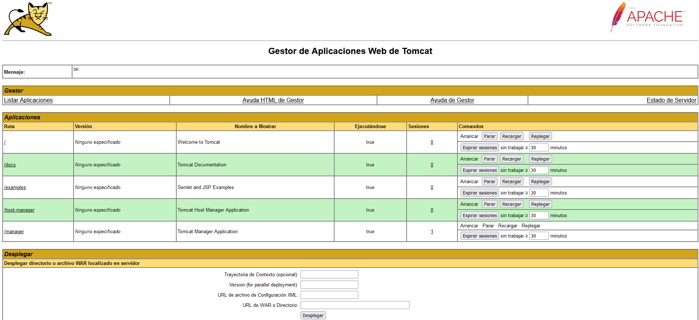
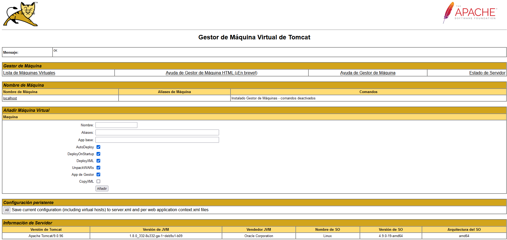

# Guía de Instalación y Configuración de Apache Tomcat en Debian 9

## Introducción

Apache Tomcat es un servidor web y contenedor de servlets que se usa para servir aplicaciones Java. Tomcat es una implementación de código abierto de las tecnologías Java Servlet y JavaServer Pages, lanzada por la Apache Software Foundation. Este tutorial cubre la instalación básica y algunas configuraciones de la última versión de Tomcat 9 en tu servidor Debian 9.

## Prerrequisitos

Antes de comenzar, asegúrate de tener un usuario no root con privilegios de sudo configurado en tu servidor.

## Paso 1 — Instalar Java

Tomcat requiere que Java esté instalado en el servidor para ejecutar el código de aplicaciones web Java. Podemos satisfacer este requisito instalando OpenJDK.

Actualiza el índice de paquetes:

```bash
sudo apt update
```

Instala el paquete del Kit de Desarrollo de Java (JDK):

```bash
sudo apt install default-jdk
```

Una vez que Java esté instalado, podemos crear un usuario `tomcat` para ejecutar el servicio de Tomcat.

## Paso 2 — Crear el Usuario Tomcat

Por motivos de seguridad, Tomcat debe ejecutarse como un usuario sin privilegios (es decir, que no sea root). Crearemos un nuevo usuario y grupo para ejecutar el servicio Tomcat.

Primero, crea un nuevo grupo `tomcat`:

```bash
sudo groupadd tomcat
```

Luego, crea un nuevo usuario `tomcat`, miembro del grupo `tomcat`, con un directorio principal en `/opt/tomcat` (donde instalaremos Tomcat) y con un shell `/bin/false` para evitar que alguien inicie sesión en la cuenta:

```bash
sudo useradd -s /bin/false -g tomcat -d /opt/tomcat tomcat
```

## Paso 3 — Instalar Tomcat

La mejor manera de instalar Tomcat 9 es descargar la última versión binaria y configurarla manualmente.

1. Encuentra la última versión de Tomcat 9 en la página de [Descargas de Tomcat 9](https://tomcat.apache.org/download-90.cgi).
2. En la sección de Distribuciones Binarias, bajo la lista Core, copia el enlace del archivo “tar.gz”.

Cambia al directorio `/tmp` en tu servidor para descargar el archivo temporalmente:

```bash
cd /tmp
```

Descarga el archivo `tar.gz` del enlace copiado:

```bash
wget https://dlcdn.apache.org/tomcat/tomcat-9/v9.0.96/bin/apache-tomcat-9.0.96.tar.gz
```

Crea el directorio `/opt/tomcat` y extrae el archivo en este:

```bash
sudo mkdir /opt/tomcat
sudo tar xzvf apache-tomcat-9*tar.gz -C /opt/tomcat --strip-components=1
```

## Paso 4 — Actualizar Permisos

Otorga acceso al usuario `tomcat` a la instalación de Tomcat:

Cambia al directorio donde descomprimiste Tomcat:

```bash
cd /opt/tomcat
```

Otorga al grupo `tomcat` la propiedad de toda la instalación:

```bash
sudo chgrp -R tomcat /opt/tomcat
```

Da permisos de lectura al grupo `tomcat` en el directorio `conf` y todos sus contenidos, y permisos de ejecución en el directorio mismo:

```bash
sudo chmod -R g+r conf
sudo chmod g+x conf
```

Haz que el usuario `tomcat` sea el propietario de los directorios `webapps`, `work`, `temp` y `logs`:

```bash
sudo chown -R tomcat webapps/ work/ temp/ logs/
```

## Paso 5 — Crear un Archivo de Servicio systemd

Para poder ejecutar Tomcat como un servicio, crearemos un archivo de servicio para `systemd`.

Busca la ruta de `JAVA_HOME` ejecutando:

```bash
sudo update-java-alternatives -l
```

El último campo del resultado es el valor de `JAVA_HOME`, que usaremos en el archivo de servicio.

Abre un archivo llamado `tomcat.service` en `/etc/systemd/system`:

```bash
sudo nano /etc/systemd/system/tomcat.service
```

Pega el siguiente contenido, ajustando `JAVA_HOME` si es necesario:

```ini
[Unit]
Description=Apache Tomcat Web Application Container
After=network.target

[Service]
Type=forking

Environment=JAVA_HOME=/usr/lib/jvm/java-1.8.0-openjdk-amd64
Environment=CATALINA_PID=/opt/tomcat/temp/tomcat.pid
Environment=CATALINA_HOME=/opt/tomcat
Environment=CATALINA_BASE=/opt/tomcat
Environment='CATALINA_OPTS=-Xms512M -Xmx1024M -server -XX:+UseParallelGC'
Environment='JAVA_OPTS=-Djava.awt.headless=true -Djava.security.egd=file:/dev/./urandom'

ExecStart=/opt/tomcat/bin/startup.sh
ExecStop=/opt/tomcat/bin/shutdown.sh

User=tomcat
Group=tomcat
UMask=0007
RestartSec=10
Restart=always

[Install]
WantedBy=multi-user.target
```

Guarda y cierra el archivo, luego recarga el demonio de `systemd`:

```bash
sudo systemctl daemon-reload
```

Inicia el servicio Tomcat:

```bash
sudo systemctl start tomcat
```

Verifica que esté funcionando:

```bash
sudo systemctl status tomcat
```

## Paso 6 — Ajustar el Firewall y Probar el Servidor Tomcat

Accede a `http://server_domain_or_IP:8080` en un navegador para ver la página de bienvenida de Tomcat.

Para que Tomcat se inicie automáticamente al arrancar:

```bash
sudo systemctl enable tomcat
```

## Paso 7 — Configurar la Interfaz de Administración Web de Tomcat

Edita el archivo `tomcat-users.xml`:

```bash
sudo nano /opt/tomcat/conf/tomcat-users.xml
```

Agrega un usuario para acceder a las interfaces de administración:

```xml
<tomcat-users>
    <user username="admin" password="password" roles="manager-gui,admin-gui"/>
</tomcat-users>
```

Para permitir conexiones desde cualquier IP a las aplicaciones de administración, abre los archivos `context.xml` correspondientes y comenta la restricción de IP:

```bash
sudo nano /opt/tomcat/webapps/manager/META-INF/context.xml
sudo nano /opt/tomcat/webapps/host-manager/META-INF/context.xml
sudo nano /opt/tomcat/webapps/examples/META-INF/context.xml
```

Dentro de cada archivo, comenta la línea que contiene `RemoteAddrValve`:

```xml
<Context antiResourceLocking="false" privileged="true">
  <!--<Valve className="org.apache.catalina.valves.RemoteAddrValve"
         allow="127\.\d+\.\d+\.\d+|::1|0:0:0:0:0:0:0:1" />-->
</Context>
```

Reinicia Tomcat:

```bash
sudo systemctl restart tomcat
```

## Paso 8 — Acceder a la Interfaz Web

Ahora puedes acceder a la interfaz de administración en `http://server_domain_or_IP:8080`.

## Verificación de la Aplicación Manager y Host Manager

La página que verás debe ser la misma que verificaste anteriormente:



### Página raíz de Tomcat

Veamos la aplicación **Manager App**, accesible mediante el enlace o `http://server_domain_or_IP:8080/manager/html`. Necesitarás ingresar las credenciales de la cuenta que agregaste en el archivo `tomcat-users.xml`. Luego, deberías ver una página como esta:



#### Tomcat Web Application Manager

El **Web Application Manager** se utiliza para gestionar tus aplicaciones Java. Aquí puedes Iniciar, Detener, Recargar, Desplegar y Eliminar aplicaciones. También puedes ejecutar diagnósticos en tus aplicaciones (por ejemplo, encontrar fugas de memoria). Al final de esta página, encontrarás información sobre el servidor.

Ahora, echemos un vistazo al **Host Manager**, accesible mediante el enlace o `http://server_domain_or_IP:8080/host-manager/html/`:



#### Tomcat Virtual Host Manager

Desde la página del **Virtual Host Manager**, puedes agregar hosts virtuales para servir tus aplicaciones.

## Conclusión

¡La instalación de Tomcat está completa! Ahora puedes desplegar tus propias aplicaciones web Java.
